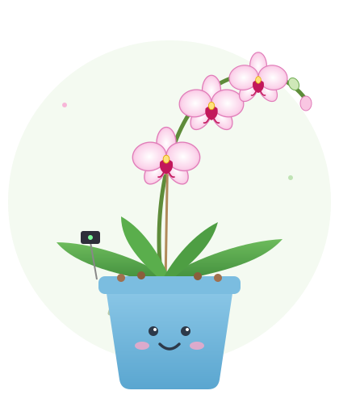

# 🌸 No Drama Phalaenopsis: Smart Orchid Greenhouse

<p align="center">
  
</p>

<p align="center">
  <em>A tiny weather station that keeps an eye on one very pampered orchid.</em>
</p>

---

## What is this?

A **Phalaenopsis** (moth orchid) lives in an **IKEA ÅKERBÄR** greenhouse cabinet on the veranda, at least sometimes. Three sensors watch its air, soil and light all day and night. A small Wi-Fi board sends the readings to a **Raspberry Pi 4** inside the house. The Pi saves them, draws charts, and shows the latest numbers on a small **Inky pHAT** e-ink screen.

**Why?** A Phalaenopsis usually needs a few weeks of **cool nights (about 13–16 °C)** before it starts a new flower spike. The Pi counts those nights, so we know whether the orchid is getting what it needs, and it warns us if it ever gets too cold (below 10 °C).

This project is built by a young maker (age 12) with a grown-up helper. **No soldering required.**

---

## How it works

```
 ON THE VERANDA                                            INSIDE THE HOUSE
┌──────────────────────────────────────────────┐         ┌─────────────────────┐
│  Light sensor ─┐                             │  Wi-Fi  │  Raspberry Pi 4     │
│  Air sensor   ─┼── ESP32-S2 Feather ─────────├────────▶│  saves & charts     │
│  Soil sensor  ─┘   (the messenger)           │         │  + Inky pHAT screen │
└──────────────────────────────────────────────┘         └─────────────────────┘
      the senses                                               the brain
```

| Part | Role | Measures |
|---|---|---|
| Adafruit BH1750 (STEMMA QT) | Light sensor | Brightness in lux |
| Adafruit BME280 (STEMMA QT) | Air sensor | Temperature, humidity, pressure |
| Adafruit STEMMA Soil Sensor | Soil sensor | How wet the potting mix is |
| Adafruit ESP32-S2 Feather | Messenger | Reads the sensors, sends the data over Wi-Fi |
| Raspberry Pi 4 | Brain | Receives, saves and charts the readings |
| Pimoroni Inky pHAT | Screen | Shows the latest readings on the Pi |

---

## Shopping list

| Qty | Item | Adafruit PID |
|---|---|---|
| 1 | ESP32-S2 Feather (4 MB Flash + 2 MB PSRAM) | — |
| 1 | BH1750 Light Sensor – STEMMA QT / Qwiic | [4681](https://www.adafruit.com/product/4681) |
| 1 | BME280 Temperature/Humidity/Pressure – STEMMA QT | — |
| 1 | STEMMA Soil Sensor (I²C capacitive moisture) | — |
| 1 | STEMMA QT cable, 300 mm | [5384](https://www.adafruit.com/product/5384) |
| 2 | STEMMA QT cable, 200 mm (one is a spare) | [4401](https://www.adafruit.com/product/4401) |
| 1 | STEMMA QT cable, 100 mm (spare / early testing) | [4210](https://www.adafruit.com/product/4210) |
| 1 | JST PH → JST SH 4-pin cable, 200 mm (for the soil sensor) | — |
| 1 | USB-C **data** cable | — |
| 1 | 3.7 V LiPo battery with 2-pin JST-PH plug | — |
| 1 | Raspberry Pi 4 + microSD card + power supply | — |
| 1 | Pimoroni Inky pHAT | — |
| 1 | IKEA ÅKERBÄR greenhouse cabinet | — |
| 1 | Small waterproof box for the Feather and battery | — |

---

## Wiring (one chain, no soldering)

```
Feather ──300 mm──▶ Light sensor ──200 mm──▶ Air sensor ──soil cable──▶ Soil sensor
         STEMMA QT      (BH1750)   STEMMA QT   (BME280)   JST SH → PH
```

All sensors share one I²C bus. Each one has its own address, so they don't get mixed up:

| Sensor | I²C address |
|---|---|
| BH1750 light | `0x23` |
| Soil sensor | `0x36` |
| BME280 air | `0x77` |

---

## Software

| Where | What |
|---|---|
| ESP32-S2 Feather | CircuitPython **10.x** (board: *Feather ESP32-S2*) |
| Feather libraries | `adafruit_bh1750`, `adafruit_bme280`, `adafruit_seesaw`, `adafruit_bus_device`, `adafruit_register` (from the CircuitPython Library Bundle 10.x) |
| Mac | Thonny (set to *CircuitPython (generic)*) to edit `code.py` and watch the output |
| Raspberry Pi 4 | Raspberry Pi OS (64-bit), SSH enabled, Pimoroni `inky` library |

---

## Quick start (📖 Word document has very detailed step by step instructions)

1. **Install CircuitPython** on the Feather from [circuitpython.org](https://circuitpython.org/board/adafruit_feather_esp32s2/). If drag-and-drop gives errors on macOS, use **Open Installer** in Chrome.
2. **Copy the 5 libraries** into `CIRCUITPY/lib/`.
3. **Copy [`code.py`](code.py)** onto the `CIRCUITPY` drive. The Feather runs it automatically. Don't press *Run* on the computer.
4. **Plug in the sensors one at a time** (USB unplugged each time), and watch the output in Thonny:

```
Devices found: ['0x23', '0x36', '0x77']
AIR:   OK   temp = 16.2 C   humidity = 71 %
SOIL:  OK   moisture = 580
LIGHT: OK   light = 8420 lux
```

5. When all three say **OK**, move everything into the greenhouse.

The full step-by-step guide for kids and grown-ups is in **`Smart_Orchid_Greenhouse_Build_Guide_v2.docx`**.

---

## Placement tips

- **Air sensor:** inside the greenhouse, near the orchid, hanging in the air. Keep it away from spray, glass and the Feather.
- **Soil sensor:** gently into the bark/moss, never through the roots. The top with the plug stays dry.
- **Light sensor:** chip facing up, getting the same light as the leaves.
- **Feather + battery:** in a waterproof box **outside** the humid greenhouse, out of rain and direct sun.

---

## Roadmap

- [x] CircuitPython installed on the Feather
- [x] Sensor test program
- [ ] All three sensors connected and tested
- [ ] Feather connects to home Wi-Fi (2.4 GHz)
- [ ] Feather sends readings to the Raspberry Pi
- [ ] Pi saves the readings
- [ ] Daily charts: temperature, humidity, light, soil
- [ ] Cool-night counter (e.g. *"Cool nights: 6 / 14"*)
- [ ] Latest readings on the Inky pHAT screen
- [ ] Runs on battery

---

## Safety

- ⚡ **No battery while building.** The Feather is powered over USB until everything works.
- 🔌 **Unplug USB** before plugging or unplugging any sensor.
- 🔋 **LiPo battery = grown-up job.** Red wire to **+**. Never reverse it, never charge below 0 °C, stop using it if it's puffy or hot.
- 💧 **Keep water away** from the Feather and the top of the soil sensor.

---

<p align="center">Made with 🌱 patience, ☕ and one very demanding orchid.</p>
